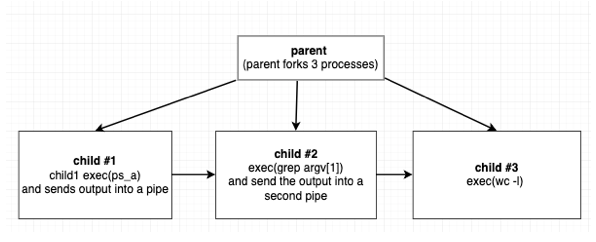
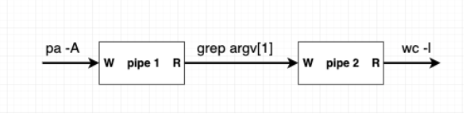

##### fork() 

This program is in a way how the shell works.
Shell would be running in an infinite loop and waiting for the user input.
Once it has an input it would fork a process that would call exec()
To compile: g++ processes.cpp -o processes   or g++ processes.cpp
To execute: ./processes kworker or ./a.out kworker

```{python}
(base) [npovey@ka fork]$ ps -A 

 94946 ?        00:00:01 python
 94947 ?        00:00:41 python
 94948 ?        00:00:01 python
 94955 ?        00:00:01 python
 94956 ?        00:00:01 python
 94981 ?        00:00:01 python
 94995 ?        00:00:01 python
 95007 ?        00:00:01 python
 95023 ?        00:00:02 python
109045 ?        00:00:08 screen
109046 pts/4    00:00:00 bash
...
(base) [npovey@ka fork]$ ps -A | grep python | wc -l
105
(base) [npovey@ka fork]$ ./processes python
105
(base) [npovey@ka fork]$ ps -A | grep sshd | wc -l  
7
(base) [npovey@ka fork]$ ./processes sshd
7
(base) [npovey@ka fork]$ ps -A | grep scsi | wc -l
16
(base) [npovey@ka fork]$ ./processes scsi
16
```





